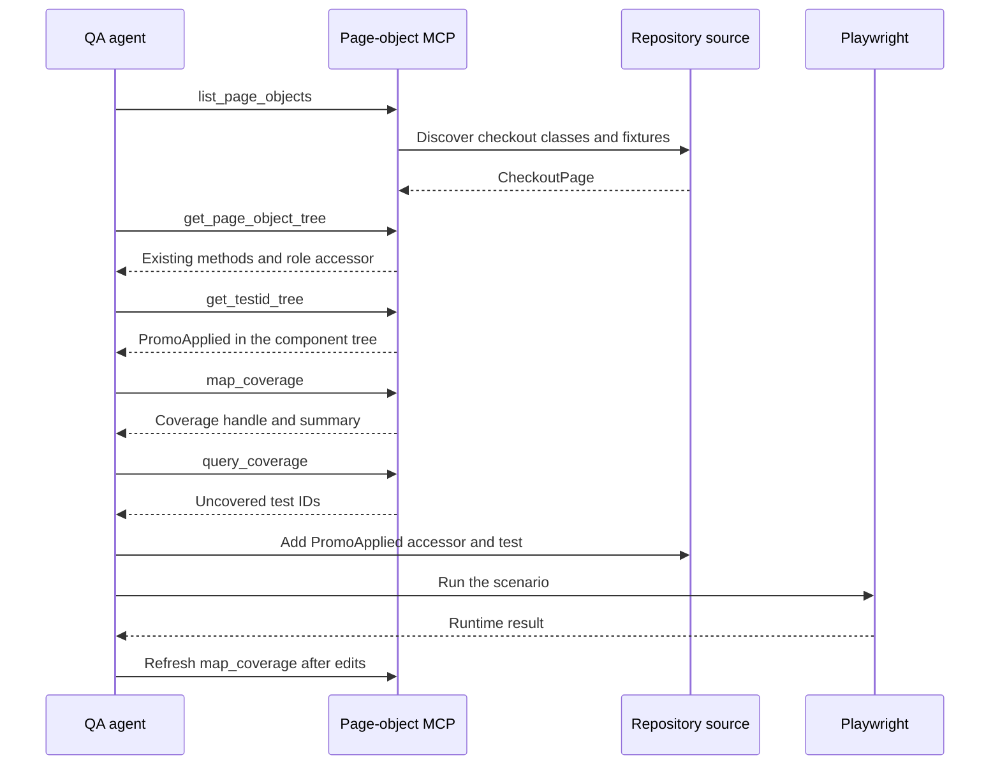

Playwright tests with AI agents work best when each agent handles a different kind of evidence. OpenSpec defines the intended behavior. Test IDs provide stable UI anchors. `playwright-page-object` MCP exposes source relationships. A Playwright run proves what happens in the browser. None of those signals can replace the other three.

This tutorial follows one small checkout change from proposal to verified E2E test. The analyst specifies visible confirmation after applying `SAVE20`. The developer implements it and marks intentional test IDs. The QA agent inspects the real page-object graph, adds one accessor instead of every uncovered ID, runs the test, and returns the result for review.

## Why do AI-generated E2E tests drift from requirements?

Generated tests drift when an agent has only a ticket and a source tree. It may invent a plausible selector, test an implementation detail, or cover the click while missing the required outcome. A spec-driven E2E testing workflow gives the agent a behavior contract and a separate way to discover the code that implements it.

The contract still needs boundaries. [OpenSpec](https://github.com/Fission-AI/OpenSpec/blob/main/docs/overview.md) organizes a change around proposal, specification, design, and tasks. The spec says what the user must observe. The design records implementation choices, including intentional test IDs. Tasks name the work. Tests prove the behavior.

That separation prevents a common mistake: treating a selector inventory as the test plan. A test ID says that an element can be addressed. It does not say that the element represents a requirement, that a test exercises it, or that the behavior works.

The full handoff looks like this:

<figure>
  <a href="/images/blog/openspec-playwright-agent-workflow.webp">
    
  </a>
  <figcaption>
    Each stage produces a different kind of evidence. Select the diagram to open
    the full-size version.
  </figcaption>
</figure>

In prose, the analyst owns the acceptance boundary, the developer owns application behavior and testability, and QA owns independent proof. A failed browser run returns to implementation. A passing run still stops at the normal review and delivery gates before archival.

## How does an analyst draft an OpenSpec change?

The analyst writes an observable outcome, not a locator recipe. For this checkout, the requirement is visible confirmation after a valid promo code and no change to the cart contents. The scenario names `SAVE20` because it is meaningful test data, but it does not prescribe React state, a page-object property, or a `data-testid` value.

Assuming `checkout` is an existing capability, create a change with the normal [OpenSpec workflow](https://github.com/Fission-AI/OpenSpec/blob/main/docs/workflows.md), then add the capability delta under the change's `specs` directory:

```md
## ADDED Requirements

### Requirement: Promo code confirmation

The checkout SHALL show a visible confirmation after a valid promo code is applied.

#### Scenario: Customer applies a valid promo code

- **GIVEN** the checkout contains at least one cart item
- **WHEN** the customer applies `SAVE20`
- **THEN** the checkout shows `Promo applied!`
- **AND** the cart item count does not change
```

The design artifact can then record the testing boundary without weakening the requirement:

```md
## Testability

- Keep the Apply action discoverable by its accessible button role and name.
- Mark the conditional confirmation with `data-testid="PromoApplied"`.
- Do not add test IDs when an existing user-facing locator is clearer.
```

Finally, split application work from verification in `tasks.md`:

```md
## 1. Application

- [ ] 1.1 Show `Promo applied!` after a valid code is applied. Verify with the Playwright scenario in task 2.3.
- [ ] 1.2 Add the intentional `PromoApplied` test ID. Verify it appears in `get_testid_tree`.

## 2. E2E verification

- [ ] 2.1 Inspect checkout accessors. Verify the tree exposes `applyPromoCode` and the role-based Apply control.
- [ ] 2.2 Add only the missing `PromoApplied` accessor. Verify it appears in the refreshed tree.
- [ ] 2.3 Run the Playwright scenario. Verify it passes, then refresh MCP coverage.
- [ ] 2.4 Run `/opsx:verify`. Review its findings before the normal delivery workflow.
```

OpenSpec command spelling can differ by agent client. This article uses the documentation-neutral `/opsx:*` form. Configure the expanded command profile if the client needs `/opsx:verify`; OpenSpec's [command reference](https://github.com/Fission-AI/OpenSpec/blob/main/docs/commands.md) is the current source for available commands and profiles.

## What should the developer agent implement and mark?

The developer agent implements the behavior first, then adds the test surface promised by the design. It should preserve accessible locators where they already express user intent. In this case, the Apply button has a name, while the conditional confirmation gets an explicit test ID because it is the new assertion target.

The relevant React result is small:

```tsx
<input
  aria-label="Promo code"
  data-testid="PromoCodeInput"
  id="promo"
/>

<button
  aria-label="Apply promo"
  data-testid="ApplyPromoButton"
  onClick={onApplyPromo}
  type="button"
>
  Apply
</button>

{promoApplied && (
  <span data-testid="PromoApplied">Promo applied!</span>
)}
```

Why keep `ApplyPromoButton` if the test should use a role? It may support another integration or an existing contract. Removing it is a separate decision. The QA task is narrower: choose the best existing accessor for this scenario and add only what the assertion lacks. Playwright recommends prioritizing [user-facing locators](https://playwright.dev/docs/locators), while test IDs remain useful as explicit testing contracts.

At this point, the developer checks off the application tasks but does not declare the behavior complete. Source code and static analysis cannot prove that the conditional message becomes visible after a real click.

## How does the QA agent inspect the page-object and UI graph?

The QA agent starts from the scenario, not from `uncoveredTestIds`. It asks five focused MCP questions to discover the checkout fixture, existing methods, the UI tree, and any selector gaps. The [MCP quick start](/mcp/quick-start/) covers setup, while the [workflow guide](/mcp/workflows/) explains the intended call order.

The call sequence is:

```text
list_page_objects {"filter":"Checkout"}
get_page_object_tree {"class":"CheckoutPage","format":"outline"}
get_testid_tree {"file":"src/components/CheckoutPage.tsx","component":"CheckoutPage","format":"outline"}
map_coverage {"buckets":[],"includeRawLocators":true}
query_coverage {"coverageId":"<from map_coverage>","bucket":"uncoveredTestIds"}
```

Run the MCP server from the application root so its Playwright config, test directory, and source tree line up. In this repository's checkout example, that sequence measured 13 matchable UI test IDs, 5 covered IDs, 18 matched selector usages, 0 dead selectors, and 8 uncovered IDs. Coverage was about 38 percent.

Those numbers are structural evidence, not a pass rate. The analyzer also reported `ui-scope-incomplete` because static traversal reached an external React component boundary. The [tool reference](/mcp/tools/) documents the buckets, and the [limitations guide](/mcp/limitations/) explains why unresolved source boundaries must remain visible.

The interaction is easier to audit as a sequence:



The QA agent reads source relationships through MCP, edits the test surface, then uses Playwright for runtime proof. Any relevant source edit invalidates the old coverage snapshot, so the final `map_coverage` call must create a fresh handle.

## Why is an uncovered test ID not an untested behavior?

An uncovered ID means no analyzed test-ID selector matched it in that coverage run. It does not account for role, label, or text locators as equivalent coverage, and it does not observe test execution. The checkout result makes the distinction concrete: `ApplyPromoButton` is uncovered even though `CheckoutPage` already reaches it by role.

The tree exposes this existing member:

```ts
@SelectorByRole("button", { name: "Apply" })
accessor ApplyPromoButton = new ButtonControl();

async applyPromoCode(code: string) {
  await this.PromoCode.$.fill(code);
  await this.ApplyPromoButton.$.click();
}
```

Adding `@Selector("ApplyPromoButton")` would duplicate a more user-centered accessor. The QA agent rejects that coverage suggestion. It adds only the missing assertion target:

```ts
@Selector("PromoApplied")
accessor PromoApplied = new PageObject();
```

<Callout type="warn" title="Coverage is a queue for investigation">
  Never generate one test or one accessor for every uncovered ID. First connect the ID to an OpenSpec scenario, check for role, label, text, or existing page-object access, and decide whether the UI element is part of observable behavior. Otherwise, coverage work creates duplicates without increasing behavioral confidence.
</Callout>

This is also why test ID coverage should not become a release target by itself. A lower percentage can be correct when accessible locators already cover the important controls. A higher percentage can still hide assertions that never prove the requirement.

## How does QA prove Playwright tests with AI agents?

The final test reuses the checkout fixture and `applyPromoCode` method discovered from the page-object tree. It records the cart count before the action, waits for the exact confirmation text, and then proves the count is unchanged. That maps each assertion back to the OpenSpec scenario.

```ts
import { test } from "./fixtures";

test.beforeEach(async ({ page }) => {
  await page.goto("/");
});

test("shows confirmation after applying a promo code", async ({
  checkoutPage,
}) => {
  const itemCount = await checkoutPage.CartItems.count();

  await checkoutPage.applyPromoCode("SAVE20");

  await checkoutPage.PromoApplied.waitText("Promo applied!");
  await checkoutPage.expectCartHasItemCount(itemCount);
});
```

The fixture pattern is documented in the [Playwright fixtures guide](/guides/fixtures/). The agent should run the narrow test first, then the appropriate project suite. [Playwright Test Agents](https://playwright.dev/docs/test-agents) provide planner, generator, and healer roles, but they are optional. The analyst, developer, and QA roles here are an orchestration convention, not a native OpenSpec integration.

A healer also needs a firm boundary. It may repair a locator or wait when the implementation changed, but it must not rewrite the acceptance criteria, remove the unchanged-count assertion, or add `test.fixme` to make the run green. Any new skip should fail the QA gate and return to human review.

## What evidence closes the OpenSpec change?

The change closes only when the intended behavior, source structure, and runtime result agree. `/opsx:verify` adds an agent review of the implementation against the change artifacts, but it is not a replacement for Playwright. OpenSpec validation checks artifact structure; the browser run proves behavior.

| Evidence | What it establishes | What it cannot establish |
| --- | --- | --- |
| OpenSpec scenario | The required user-visible outcome | Whether code implements it |
| Intentional test IDs | Stable UI anchors chosen by the team | Whether the behavior is tested |
| `playwright-page-object` MCP | Page objects, selectors, methods, UI IDs, and static relationships present in source | What happens in a running browser |
| Playwright execution | The scenario passes against the application at runtime | Whether the requirement itself was the right product decision |

After the test passes, refresh MCP coverage, run `/opsx:verify`, and review any warnings. OpenSpec verification can surface inconsistencies, but warnings do not automatically block archival. The team still applies its normal code review, CI, approval, and delivery rules. Archive the change only after that workflow finishes, not merely because an agent produced a green local run.

## Where should agents stop for human review?

Agents should stop when a decision changes product meaning, public behavior, test strategy, or delivery scope. They can resolve routine source discovery and write a test that follows an approved scenario. They should not silently decide that a different confirmation message is close enough or that an uncovered ID deserves a new public contract.

Require a human decision when:

- the implementation conflicts with the OpenSpec scenario;
- the best locator would require changing accessibility semantics;
- a new test ID becomes a long-lived public convention;
- the test can pass only by weakening or skipping an assertion;
- `/opsx:verify`, CI, or review finds a material mismatch;
- archival would bypass the repository's normal delivery workflow.

That boundary keeps the OpenSpec Playwright workflow useful. Agents handle repeatable discovery and implementation work. People keep control of requirements, tradeoffs, and release decisions.

## FAQ

The short answer is that OpenSpec, Playwright Test Agents, test IDs, and MCP each cover a different boundary. The questions below separate specification from generation, accessible locators from test-ID contracts, static source coverage from browser proof, and a passing local test from a change that is ready to archive.

<BlogFaq>
<BlogFaqItem
  id="does-openspec-generate-playwright-tests"
  title="Does OpenSpec generate Playwright tests?"
>

No. OpenSpec structures the change and its behavioral requirements. An agent can use those artifacts to write a Playwright test, but OpenSpec does not provide a native Playwright generator or coordinate the analyst, developer, and QA roles described here. The test-writing step belongs to the chosen coding or QA agent.

</BlogFaqItem>
<BlogFaqItem
  id="are-test-ids-required-for-playwright-tests-with-ai-agents"
  title="Are test IDs required for Playwright tests with AI agents?"
>

No. Prefer roles, labels, and other user-facing locators when they express the interaction clearly. Add a test ID when the team wants an explicit stable contract, such as the conditional `PromoApplied` assertion target. The MCP coverage map reports test-ID relationships without claiming that every element needs one.

</BlogFaqItem>
<BlogFaqItem
  id="is-this-the-same-as-playwright-test-agents"
  title="Is this the same as Playwright Test Agents?"
>

No. Playwright Test Agents provide optional planner, generator, and healer definitions for test generation. This workflow assigns broader delivery responsibilities around an OpenSpec change. A team can use Playwright's agents for the QA portion, another coding agent, or its own orchestration. OpenSpec does not coordinate those agents automatically.

</BlogFaqItem>
<BlogFaqItem
  id="can-mcp-coverage-replace-running-playwright"
  title="Can MCP coverage replace running Playwright?"
>

No. The MCP server performs read-only static analysis. It can show that selectors and UI IDs appear to line up in source, but it does not launch the application or observe the DOM. Run Playwright to prove the scenario in a browser, including the state transition and required assertions.

</BlogFaqItem>
<BlogFaqItem
  id="when-should-the-openspec-change-be-archived"
  title="When should the OpenSpec change be archived?"
>

Archive after the implementation and test are complete, the relevant Playwright run and project checks pass, MCP coverage has been refreshed, `/opsx:verify` has been reviewed, and the repository's normal review and delivery workflow is finished. A local agent result alone is not sufficient.

</BlogFaqItem>
</BlogFaq>
